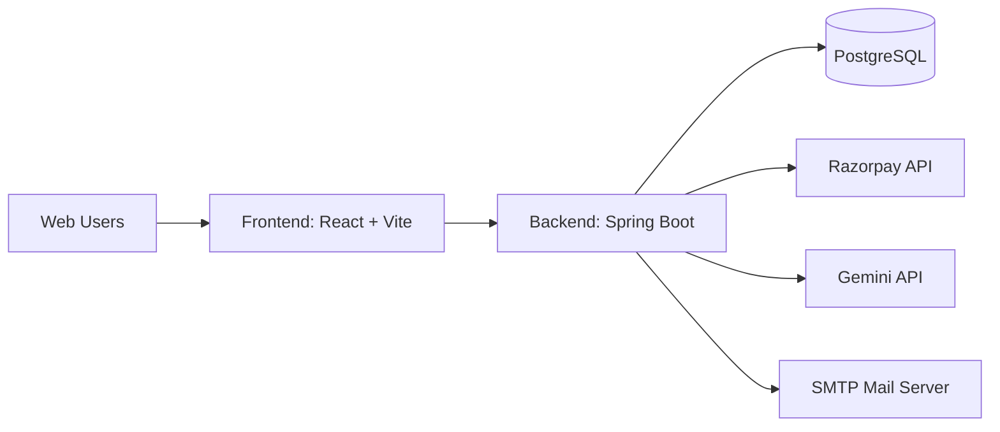

# Subscriptor

> A full-stack subscription and billing platform with role-based access, payments, invoicing, organization management, and AI-assisted workflows.

## Product Snapshot

Subscriptor is designed for SaaS-style operations where organizations, admins, and platform owners need a clean flow for onboarding, subscription management, invoicing, and payment confirmation.

### Core Highlights

- Spring Boot backend with modular domains (auth, billing, payment, invoice, notification, analytics, AI).
- React + Vite frontend with protected routes and role-driven dashboards.
- PostgreSQL persistence with Flyway migrations.
- JWT-based authentication and authorization.
- Razorpay payment integration and public checkout flows.
- AI-ready service layer for Gemini-backed features.

## Architecture



## Tech Stack

- Frontend: React 19, Vite 8, React Router, Axios, Tailwind CSS.
- Backend: Spring Boot 4, Spring Security, Spring Data JPA, Flyway, JWT.
- Database: PostgreSQL.
- Payments: Razorpay.
- Documentation: springdoc OpenAPI (Swagger UI).

## Project Structure

```text
Integration/
|- backend/
|  |- src/main/java/com/app/...
|  |- src/main/resources/
|  |- pom.xml
|- frontend/
|  |- src/
|  |- public/
|  |- package.json
|- README.md
```

## Environment Configuration

Create and fill these files:

- backend/.env
- frontend/.env

Note: the backend reads OS environment variables at runtime. If you use .env files, load them in your IDE run configuration or shell before starting Spring Boot.

### Backend .env Keys

```env
SERVER_PORT=8080
DB_URL=jdbc:postgresql://localhost:5432/subscription_billing_new
DB_USERNAME=postgres
DB_PASSWORD=postgres
JWT_SECRET=ChangeThisJwtSecretBeforeProduction
JWT_EXPIRATION=86400000
JWT_REFRESH_EXPIRATION=604800000
MAIL_HOST=smtp.gmail.com
MAIL_PORT=587
MAIL_USERNAME=
MAIL_PASSWORD=
MAIL_SSL_TRUST=smtp.gmail.com
MAIL_DEBUG=false
RAZORPAY_KEY_ID=
RAZORPAY_KEY_SECRET=
GEMINI_API_KEY=
GEMINI_MODELS=gemini-3.6-flash,gemini-3.5-flash,gemini-3.5-flash-lite,gemini-3.1-flash-lite,gemini-3-flash,gemini-2.5-flash,gemini-2.5-flash-lite
```

### Frontend .env Keys

```env
VITE_API_BASE_URL=http://localhost:8080
```

## Local Setup

### 1) Backend

```bash
cd backend
./mvnw spring-boot:run
```

Windows CMD:

```cmd
cd backend
mvnw.cmd spring-boot:run
```

### 2) Frontend

```bash
cd frontend
npm install
npm run dev
```

### 3) Access Points

- Frontend app: http://localhost:5173
- Backend API: http://localhost:8080
- Swagger UI: http://localhost:8080/swagger-ui/index.html

## Build Commands

### Backend

```bash
cd backend
./mvnw clean test
./mvnw clean package
```

### Frontend

```bash
cd frontend
npm run lint
npm run build
npm run preview
```

## Security Notes

- Never commit real API keys, JWT secrets, DB credentials, or app passwords.
- Rotate `JWT_SECRET`, `RAZORPAY_KEY_SECRET`, and `GEMINI_API_KEY` before production.
- Restrict CORS and security policies per deployment environment.

## Roadmap Ideas

- Containerize with Docker + Compose for one-command startup.
- Add CI pipelines for lint, test, and artifact publishing.
- Introduce centralized observability (logs, tracing, metrics).
- Expand test coverage for payment and billing edge cases.
